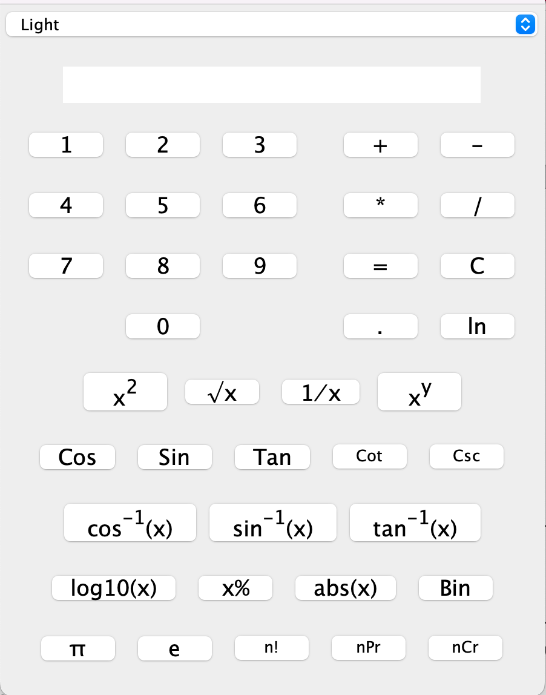

<div align="center">

# Simple Java Calculator


---
 # Project Metrics

- In-process


[](https://codeclimate.com/github/JESUSC1/Simple-Java-Calculator/test_coverage)

-  Complexity

[](https://app.codacy.com/gh/JESUSC1/Simple-Java-Calculator/dashboard?utm_source=gh&utm_medium=referral&utm_content=&utm_campaign=Badge_grade)
[](https://codeclimate.com/github/JESUSC1/Simple-Java-Calculator/maintainability)


- Workflows
[](https://github.com/JESUSC1/Simple-Java-Calculator/actions/workflows/.travis.yml)
[](https://codecov.io/gh/JESUSC1/Simple-Java-Calculator)

- Other


This calculator is **simple** with an **easy to use code** to help novices **learn how to create a calculator** program with **`Java`**.

---
  
</div>

If you use the executable "SimpleJavaCalculator.jar" file and that doesn't work, you can type this in your terminal:

```shell
java -jar /your_calculator_directory/SimpleJavaCalculator.jar`
```

## :sparkles: Example

<div>
  <h3>Orignal Calculator Before Out Changes</h3>
  
</div>

<div>
  <h3>After Our Changes</h3>
  
</div>


## 💡 Authors

### Base Application

- **[Pierre-Henry Soria](https://ph7.me)**

### Modifications and Improvements

- [Achintha Gunasekara](http://www.achinthagunasekara.com)
- [xdvrx1](https://github.com/xdvrx1)


## 📮 Contact

Pierre-Henry Soria: pierrehs [AT] hotmail [D0T] com

Achintha Gunasekara: contact [AT] achinthagunasekara [D0T] com


## ⚖️ License

Apache License, Version 2.0 or later; Read **[license.txt](./license.txt)** for further details.
