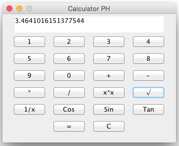

<div align="center">

# Simple Java Calculator with COMP 312 Additions


---
 
 - [Orignal Project vs Our Additions](#Look_Comparison)
 - [COMP 312 Project Modifications, Improvements, and Contributions](#COMP_312_Project_Modifications)
 - [How to use New Features](#How_to_new_features)

 
 # Project Metrics

- In-process


[](https://codeclimate.com/github/JESUSC1/Simple-Java-Calculator/test_coverage)

-  Complexity

[](https://app.codacy.com/gh/JESUSC1/Simple-Java-Calculator/dashboard?utm_source=gh&utm_medium=referral&utm_content=&utm_campaign=Badge_grade)
[](https://codeclimate.com/github/JESUSC1/Simple-Java-Calculator/maintainability)


- Workflows
[](https://github.com/JESUSC1/Simple-Java-Calculator/actions/workflows/.travis.yml)
[](https://codecov.io/gh/JESUSC1/Simple-Java-Calculator)

- Other


This calculator is **simple** with an **easy to use code** to help novices **learn how to create a calculator** program with **`Java`**.

---
  
</div>

If you use the executable "SimpleJavaCalculator.jar" file and that doesn't work, you can type this in your terminal:

```shell
java -jar /your_calculator_directory/SimpleJavaCalculator.jar`
```
<a name="Look_Comparison"></a>
## :sparkles: Example

Before                     |  After
:-------------------------:|:-------------------------:
  |  


## 💡 Authors

### Base Application

- **[Pierre-Henry Soria](https://ph7.me)**

<a name="COMP_312_Project_Modifications"></a>
### COMP 312 Project Modifications, Improvements and Contributions
- Abilty to show Text Panel on Mac (Jonathan Drysdale-Anderson)
- Button Placements (Jonathan Drysdale-Anderson)
- Button Super-Scripts (Jonathan Drysdale-Anderson)
- Inverse Trigonometric functions (Jonathan Drysdale-Anderson)
- Decimal functionality (Jonathan Drysdale-Anderson)
- Theme implementation (light, dark) (Jonathan Drysdale-Anderson)
- Undefined Feature with division (Jonathan Drysdale-Anderson)
- Ability to Run Application on Mac (Jesus Cantu)
- Pi and Euler’s number buttons (Jesus Cantu)
- Software quality metrics displayed through GitHub Badges (sources: Codacy, CodeClimate, CodeCove, Travis CI) (Jesus Cantu)
- Cot, Csc buttons (Ibrahim Ben Hadj Tahar)
- Factorials, Permutations and Combinations (Roshan Ali)
- **We contemplated doing a button that switches between degrees and radians but ran out of time to implement it properly**

## How to Use New Features
- For any trig identity simply type in a value and press the specific trig identity button
- For the pi button you can use pi by itself by just pressing the button or by doing an operation with another number such as (30*pi)
  - Note that you cannot press pi and then a number. You must press pi then an operation then a number
- For Combinations and Permuations you have to press a number then press the desired funciton and then another button followed by the equals button
- For factorials, you must first press a number and then press the factorial button
- To change Theme press the drop down menu at the top to switch from dark to light

## ⚖️ License

Apache License, Version 2.0 or later; Read **[license.txt](./license.txt)** for further details.
